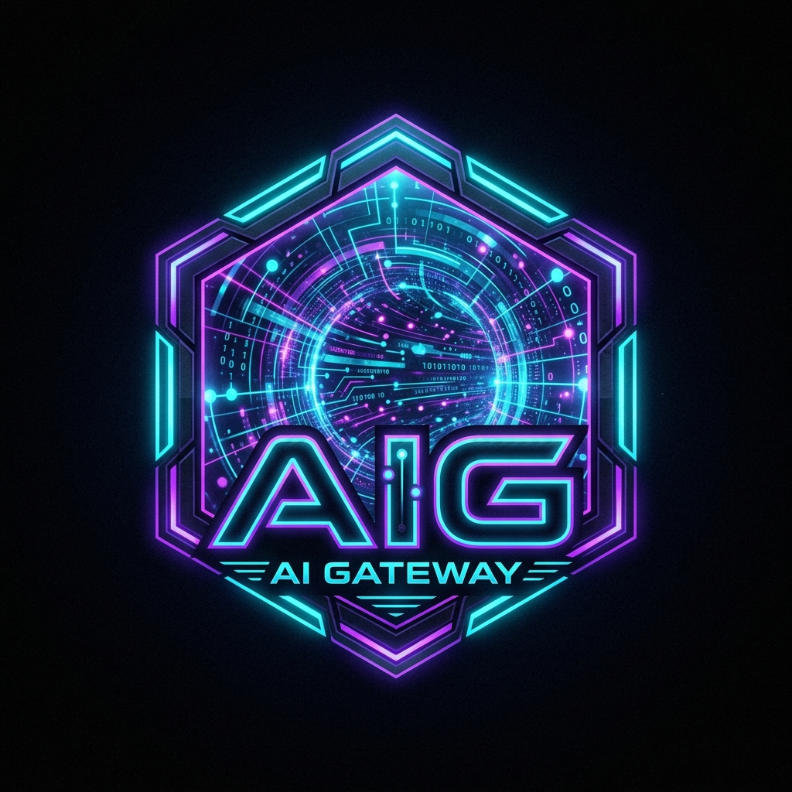

<div align="center">



# AI Gateway (AIG)

### Middleware proxy multi-fournisseur pour Claude Code CLI et Codex

**v2.4.0** · Python ≥ 3.14 · FastAPI · OpenAI-Compatible

[](https://www.python.org/)
[](https://fastapi.tiangolo.com/)
[](LICENSE)

[](README.en.md) [](README.id.md) [](README.zh.md) [](README.es.md) [](README.ja.md)
[](README.fr.md) [](README.de.md) [-047857?style=flat-square)](README.pt-BR.md) [](README.it.md) [](README.tr.md)
[](README.ru.md) [](README.ko.md) [](README.ar.md) [](README.hi.md) [](README.vi.md)

</div>

---

## AI Gateway

AI Gateway (AIG) est un middleware proxy local qui relie Claude Code CLI et OpenAI Codex CLI à plusieurs fournisseurs d'IA, sans modifier le code de votre application.

### Pourquoi AI Gateway ?

| Besoin | Réponse d'AI Gateway |
|---|---|
| Les CLI utilisent des API différentes | Traduction transparente entre les protocoles Anthropic, OpenAI et les fournisseurs configurés |

---

## Fournisseurs pris en charge

AI Gateway prend en charge **17 fournisseurs** : 14 services cloud et 3 fournisseurs locaux.

### Fournisseurs cloud

1. **NVIDIA NIM** (`nvidia_nim`)
2. **OpenRouter** (`open_router`)
3. **Gemini / Google** (`gemini`)
4. **DeepSeek** (`deepseek`)
5. **Mistral** (`mistral`)
6. **Codestral** (`mistral_codestral`)
7. **Kimi / Moonshot** (`kimi`)
8. **Wafer** (`wafer`)
9. **Fireworks AI** (`fireworks`)
10. **Z.ai** (`zai`)
11. **OpenCode Zen** (`opencode`)
12. **OpenCode Go** (`opencode_go`)
13. **Groq** (`groq`)
14. **Cerebras** (`cerebras`)

### Fournisseurs locaux (sans clé API)

15. **LM Studio** (`lmstudio` — `http://localhost:1234/v1`)
16. **Llama.cpp** (`llamacpp` — `http://localhost:8080/v1`)
17. **Ollama** (`ollama` — `http://localhost:11434`)

---

## Installation rapide

```bash
git clone https://github.com/0xgetz/ai-proxy-hub.git
cd ai-proxy-hub
uv sync
cp .env.example .env
aig-server
```

## Commandes principales

| Command | Purpose |
|---|---|
| `aig-server` | Start the gateway server |
| `aig-init` | Initialize the configuration |
| `aig-claude` | Start Claude Code through the gateway |
| `aig-codex` | Start Codex through the gateway |
| `ai-gateway` | Alias for `aig-server` |

Pour les instructions de configuration, de sécurité et d'exploitation, consultez le [README principal](README.md) et [ARCHITECTURE.md](ARCHITECTURE.md).

---

## Licence

Distribué sous licence MIT. Consultez [LICENSE](LICENSE) pour plus d'informations.
